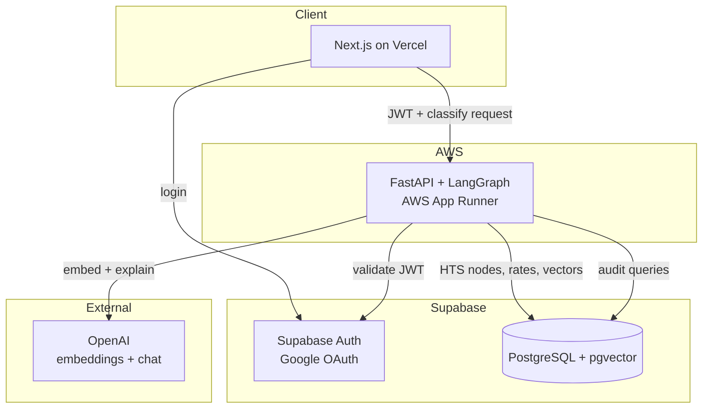
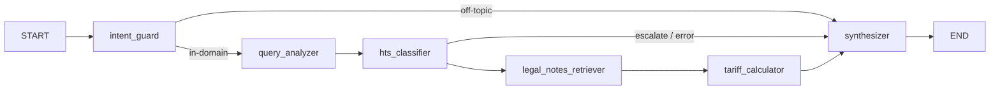

# TariffIQ

**AI-powered U.S. import HTS classification and duty estimation** — built for importers, brokers, and trade-compliance learners who need fast, explainable answers grounded in official tariff data.

Describe a product in plain language (e.g. *"steel water bottles from China, customs value $12/unit"*) and TariffIQ returns an HTS code, estimated duty rate, and a human-readable explanation. Rates come from the database, not from the LLM.

**Production API:** `https://vkujyyvbhk.us-east-1.awsapprunner.com`  
**Health check:** [`/health`](https://vkujyyvbhk.us-east-1.awsapprunner.com/health)

---

## What problem does this solve?

U.S. import duty depends on the **Harmonized Tariff Schedule (HTS)** — thousands of codes, chapter notes, and layered programs (MFN, Section 301, IEEPA, FTAs). Manual lookup is slow and error-prone.

TariffIQ combines:

- **Retrieval** over official HTS releases stored in Postgres + pgvector  
- **LLM reasoning** for query understanding and explanations  
- **Deterministic math** for duty rates (LLMs never invent tariff numbers)

---

## System design (high level)



| Layer | Technology | Role |
|-------|------------|------|
| **Frontend** | Next.js 14, TypeScript, Tailwind | Landing, Google login, chat-style classify UI, query history |
| **API** | FastAPI, LangGraph | REST API, classification pipeline, auth middleware |
| **Database** | Supabase Postgres + pgvector | HTS releases, nodes, embeddings, policy snapshots, query audit log |
| **Auth** | Supabase Auth (Google) | User identity; JWT validated on every API call |
| **AI** | OpenAI (`gpt-4o-mini`, `text-embedding-3-small`) | Query analysis, retrieval, explanations — **not** rate generation |
| **Deploy** | App Runner (API) + Vercel (UI) + ECR (container images) | Low-cost production stack |

---

## Classification pipeline (LangGraph)

Every classify request runs through a **directed graph**. Off-topic messages (e.g. *"hi"*) exit early without expensive LLM calls.



| Node | Purpose |
|------|---------|
| **intent_guard** | Rule-based + optional LLM gate — trade queries only |
| **query_analyzer** | Normalize product, origin, customs value |
| **hts_classifier** | Vector search + LLM pick among retrieved HTS candidates |
| **legal_notes_retriever** | Pull chapter/heading notes for context |
| **tariff_calculator** | Deterministic duty from `hts_nodes` + policy snapshots |
| **synthesizer** | Final JSON response + explanation |

**Design rule:** HTS codes and duty rates always trace back to stored tariff data. The LLM explains; it does not invent compliance outcomes.

---

## Repository layout

```
tariffiq/
├── apps/web/              # Next.js frontend (Vercel)
├── backend/
│   ├── api/               # FastAPI routes, JWT auth middleware
│   ├── graph/             # LangGraph pipeline + nodes
│   ├── services/          # Query orchestration
│   ├── repositories/      # DB access (HTS, queries, users)
│   └── scripts/           # Local HTS ingest
├── ingestion/             # USITC HTS JSON parser
├── supabase/migrations/   # Schema (pgvector, hts_*, queries)
├── docker/Dockerfile      # API container for App Runner
├── infra/apprunner/       # ECR + App Runner deploy scripts
├── docs/                  # Architecture, local dev, deploy guides
└── run.py                 # CLI: api | classify | ingest
```

---

## Data model (simplified)

- **`hts_releases`** — versioned USITC drops (e.g. `2026HTSRev10`)  
- **`hts_nodes`** — tariff lines with official duty rates (source of truth for math)  
- **`hts_embeddings`** — vectors for semantic retrieval only  
- **`policy_snapshots`** — Section 301 / IEEPA overlays  
- **`queries`** — audited user requests + full response JSON  
- **`users`** — synced from Supabase Auth on first classify  

---

## Quick start (local)

**Prerequisites:** Python 3.11+, Node 20+, Supabase project, OpenAI API key.

### 1. Backend

```powershell
pip install -r backend/requirements.txt
Copy-Item .env.example .env   # fill OPENAI_*, SUPABASE_*, DATABASE_URL
python run.py api
```

- API docs: http://localhost:8000/docs  
- Health: http://localhost:8000/health  

### 2. Frontend

```powershell
cd apps/web
Copy-Item .env.local.example .env.local
npm install
npm run dev
```

Open http://localhost:3000 — see [docs/LOCAL_FULLSTACK_TEST.md](docs/LOCAL_FULLSTACK_TEST.md) for Google OAuth setup.

### 3. CLI classify (no UI)

```powershell
python run.py classify "gaming laptop from China"
```

Full setup (migrations, HTS ingest): [docs/LOCAL_DEVELOPMENT.md](docs/LOCAL_DEVELOPMENT.md)

---

## Deployment

| Component | Platform | Notes |
|-----------|----------|-------|
| API | **AWS App Runner** | Docker image from ECR; min 0.25 vCPU / 0.5 GB |
| UI | **Vercel** | Root directory `apps/web` |
| DB + Auth | **Supabase** | Shared across local and prod |

```powershell
# Build image → ECR → create/update App Runner (reads .env)
.\infra\apprunner\deploy-minimal.ps1

# Or Python helper (fixed JSON config)
python infra/apprunner/create_service.py
```

Step-by-step: [docs/DEPLOY_2HOUR.md](docs/DEPLOY_2HOUR.md)

**Vercel env vars:** `NEXT_PUBLIC_API_URL`, `NEXT_PUBLIC_SUPABASE_URL`, `NEXT_PUBLIC_SUPABASE_ANON_KEY`  
After Vercel deploy, add the UI URL to `CORS_ORIGINS` and redeploy the API.

---

## API overview

| Method | Path | Auth | Description |
|--------|------|------|-------------|
| `GET` | `/health` | No | Liveness + active HTS release |
| `POST` | `/v1/classify` | Bearer JWT | Classify product + estimate duty |
| `GET` | `/v1/queries` | Bearer JWT | User query history |

---

## Further reading

- [V2 architecture (detailed)](docs/TARIFFIQ_V2_ARCHITECTURE.md)  
- [Local development](docs/LOCAL_DEVELOPMENT.md)  
- [Full-stack local test (OAuth)](docs/LOCAL_FULLSTACK_TEST.md)  
- [Deploy guide](docs/DEPLOY_2HOUR.md)  

---

## Disclaimer

TariffIQ provides **informational estimates** for learning and planning. It is not legal or customs advice. Always verify classifications and duties with a licensed customs broker or CBP before filing entries.
